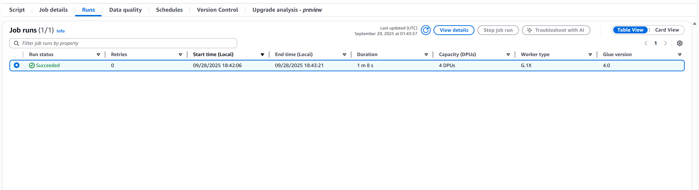
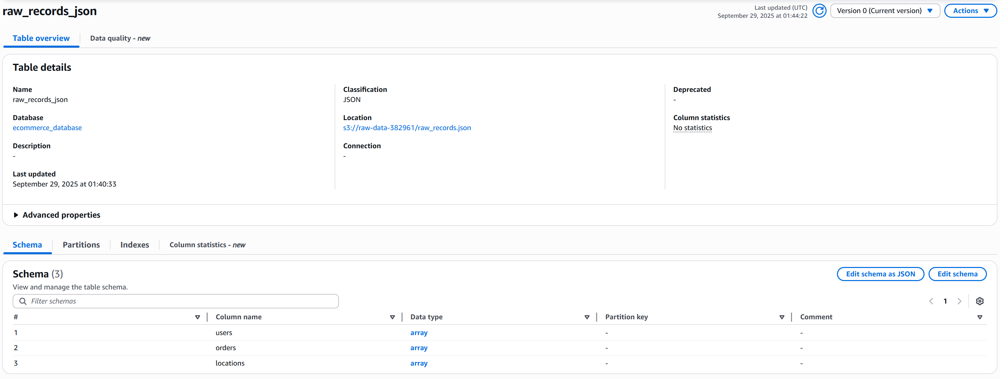
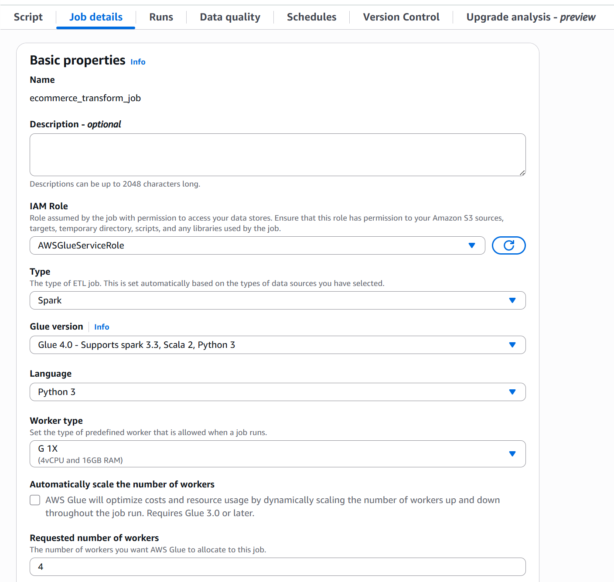

# AWS Glue ETL

## Overview
This project provides a Python-based ETL (Extract, Transform, Load) workflow using **AWS Glue**.
It processes transaction data from multiple JSON datasets, joining **user**, **order**, and **location** data into a single structured JSON output.
The transformed data is then stored in an **Amazon S3 bucket** for downstream use.

---

### Prerequisites

Make sure the following tools are installed before you begin:

* **Terraform**: Version `1.12.2` or later
* **AWS CLI**: Version `2.28.14` or later
* **Python**: Version `3.12.11` or later

---

### Setup

#### 1. Generate Sample Data

* Navigate to the `script` folder and start a Pipenv shell:
```bash
pipenv shell
```

* Run the data generation script:
```bash
python main.py
```
You should see output similar to:
```bash
Writing data to ../data/raw_records.json
Successfully created ../data/raw_records.json.
```

#### 2. Configure Buckets

* Open `platform/locals.tf` and update:
  * `raw_bucket_name`
  * `transformed_bucket_name`
  to the S3 bucket names you want to use.
* Open `platform/versions.tf` and update:
  * `s3 > bucket`
  * `s3 > key`
  to the S3 bucket and key name you want to use.

#### 3. Configure Environment Variables

* Copy the sample environment file:
  ```bash
  cp .env.sample .env
  ```
* Open `platform/modules/glue_job/transform_script.py` and set the required value:
  * `s3_bucket`: use the name of your S3 bucket for transformed data
---

### Usage

Use the `Makefile` to manage your project lifecycle:

| Command | Description |
|--------|-------------|
| `make init` | Initializes the Terraform project |
| `make plan` | Creates a deployment plan without applying changes |
| `make deploy` | Deploys the project to your AWS account |
| `make update` | Updates the deployed project |
| `make delete` | Deletes all created AWS resources |
| `make output` | Displays outputs such as API endpoints and resource IDs |
| `make console` | Interactive CLI for evaluating and experimenting with Terraform Expressions |
---

### Screenshots





---

### Debugging

Check AWS Glue job logs in **Amazon CloudWatch** to troubleshoot issues.
Use the AWS Console or CLI:

```bash
aws logs get-log-events \
  --log-group-name /aws-glue/jobs \
  --log-stream-name <YourJobLogStream>
```
